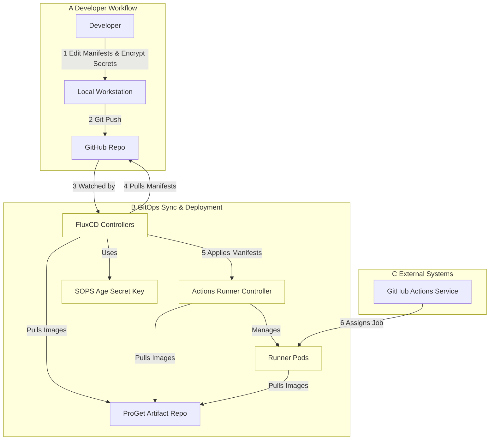

# Diagram

```mermaid
graph TD
    subgraph "A Developer Workflow"
        User["Developer"] --> |"1 Edit Manifests & Encrypt Secrets"|Workstation["Local Workstation"]
        Workstation --> |"2 Git Push"|GitHub["GitHub Repo"]
    end

    subgraph "B GitOps Sync & Deployment"
        Flux["FluxCD Controllers"]
        ARC["Actions Runner Controller"]
        Runners["Runner Pods"]
        AgeKey["SOPS Age Secret Key"]

        Flux --> |"Pulls Images"|ProGet
        ARC --> |"Pulls Images"|ProGet
        Runners --> |"Pulls Images"|ProGet
        ARC --> |"Manages"|Runners
    end

    subgraph "C External Systems"
        ProGet["ProGet Artifact Repo"]
        GHA["GitHub Actions Service"]
    end

    GitHub --> |"3 Watched by"|Flux
    Flux --> |"4 Pulls Manifests"|GitHub
    Flux --> |"Uses"|AgeKey
    Flux --> |"5 Applies Manifests"|ARC
    GHA --> |"6 Assigns Job"|Runners

    class User,Workstation dev
    class GitHub dev
    class Flux,ARC,Runners,AgeKey cluster
    class ProGet,GHA external
```